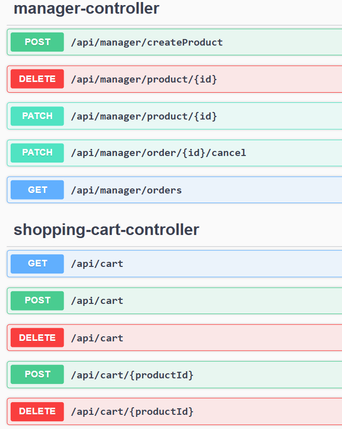

# SWA Project Group 6 Group 2 - Presentation 1

## Progress so far

    - UML diagram (webshop-UML.pdf, notifier-UML.pdf)
    - Sequenzdiagram (buy-sold-out-product.pdf)
    - Coding issues in GitLab
    - Milestones in GitLab                              
        i) Project Arcitecture (15.12.2025)
        ii) MVP (12.01.2026)
        iii) Project deadline (30.01.2026)
    - API endpoints
    - Product Model, Service, Controller + Tests

## Diagrams
### UML

### Notifier

### Sequence

## API

[Swagger UI for API endpoints](http://localhost:8080/swagger-ui/index.html)

## Currently in work

    - Deletion policies
    - Testing strategies 
    - Coding the controllers and services