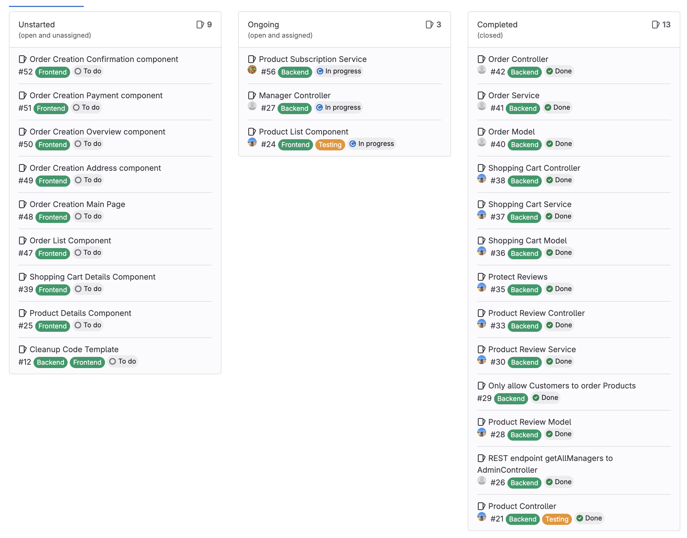

# SWA Project Group 6 Group 2 - Presentation 2
## Progress

## Challenges
1. How to fix error prone task to update frontend api (dto, functions) after backend update?
2. How can I listen to changes for items in the database (Product Updates)
3. Functionality of React (new Technology)
4. Mocking when writing controller tests

## Solution Strategies
1. Api autogeneration based on `OpenApi` spec
2. `Spring Entity Listener` - hook into entity updates where you can compare (old, new)
3. Pushed frontend development more to the end of the project, on your own time (read docs,..)
4. Compare to existing controller tests, read docs

## Next up
- Finish backend
- Group meeting on react
- Finish MVP