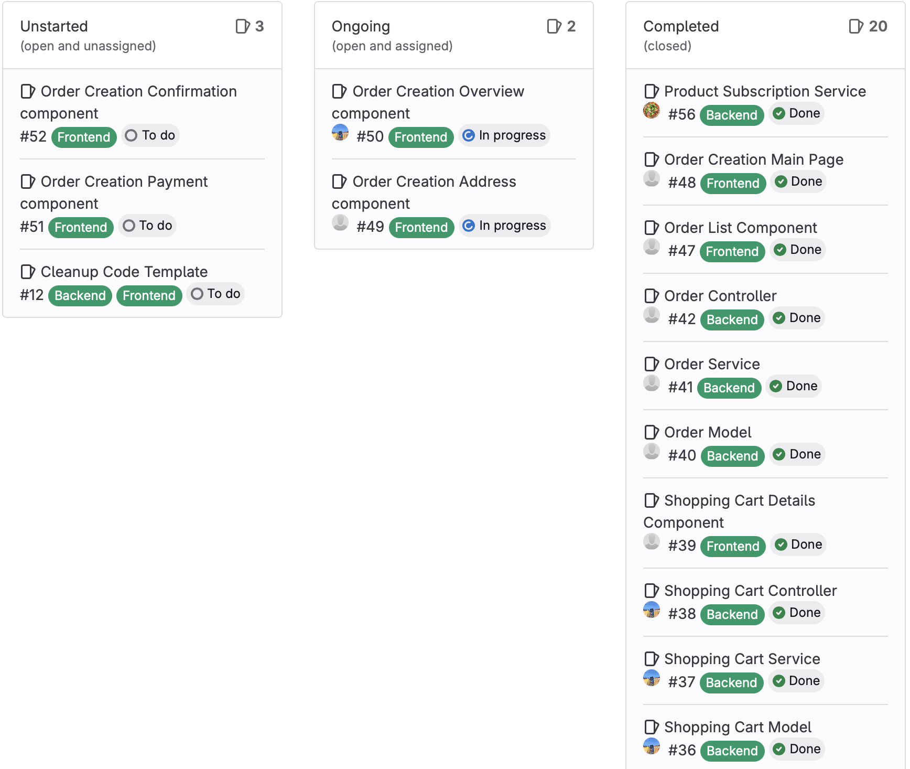
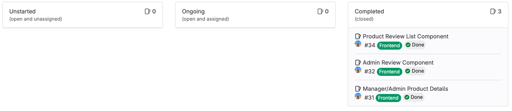
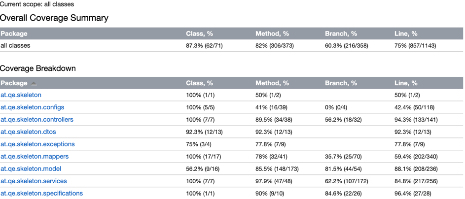
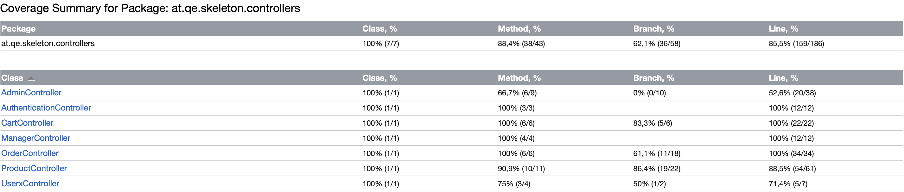
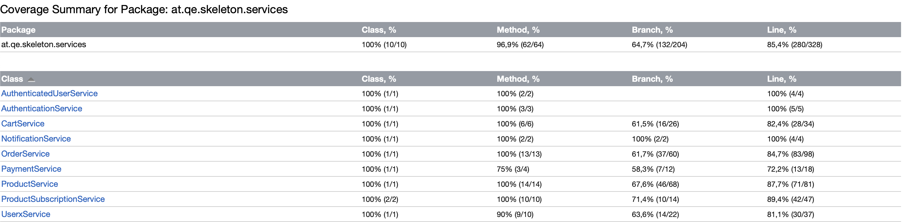

# SWA Project Group 6 Group 2 - Presentation 3
## Progress

- Project deadline issues finished
- MVP almost finished
- We solved our React problems from last week and made good progress in the frontend
- Product Subscriptions finished (Backend)
- Generally backend logic completely finished

## Challenges
1. Communication about the design of the webshop. (List/Grid/Both, Layout decisions, unified look and feel, ...)
2. Blocking of frontend issues. (Components relying on each other and subsequent waiting for team-members)

### Solution Strategies
1. Look at components from teammates and adapt your own work

## Next up

- Frontend final touches (Order process finished, Order Subscriptions)
- Frontend testing strategy and frontend testing (probably a few bugs to fix)
- Backend testing evaluation (see Screenshot)

- Backend testing final touches
