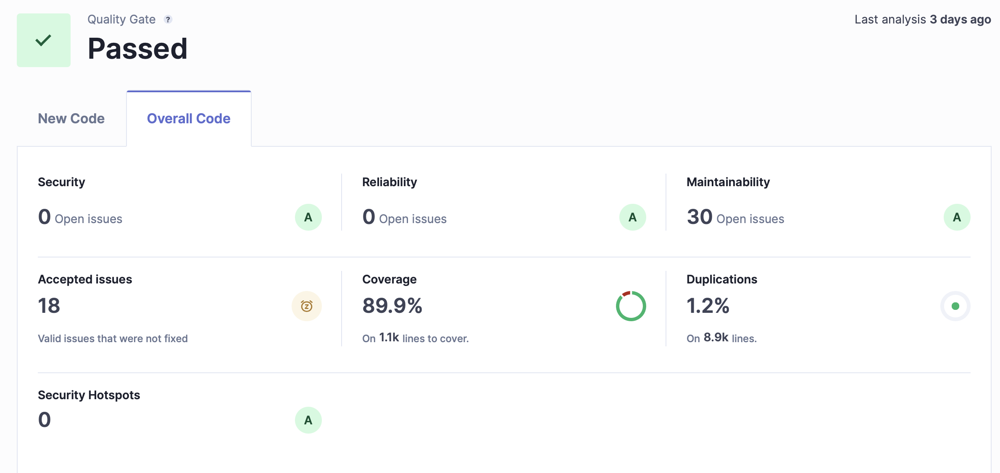

# SWA Project Group 6 Group 2 - Presentation 4
## Progress

- Backend/Frontend done, except for Product Subscriptions (Frontend)

## Challanges
### 1. Entity Listener from last week made problems
    - caused undefined behaviour in hibernate
    - query while hibernate is in the middle of a flush
    - two flushes may be triggered at the same time

### 2. failed quality gate in sonar cube
    - unresolved issues

## Solution Strategies
### 1. Entity Listener
    - now Publisher just publishes in service methods, that change something relevant

### 2. fix issues, remove false positives and accept acceptable

## Next Up
- testing frontend
- bug fixes frontend
- product subscriptions frontend

